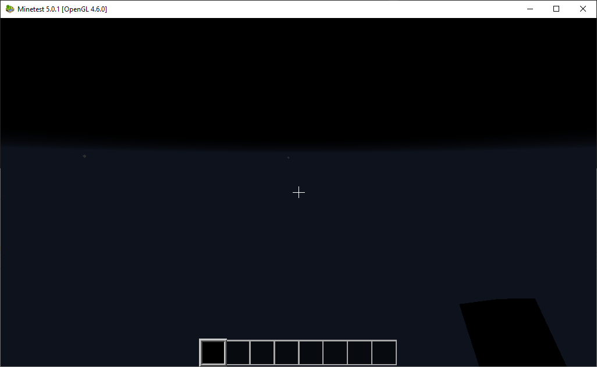
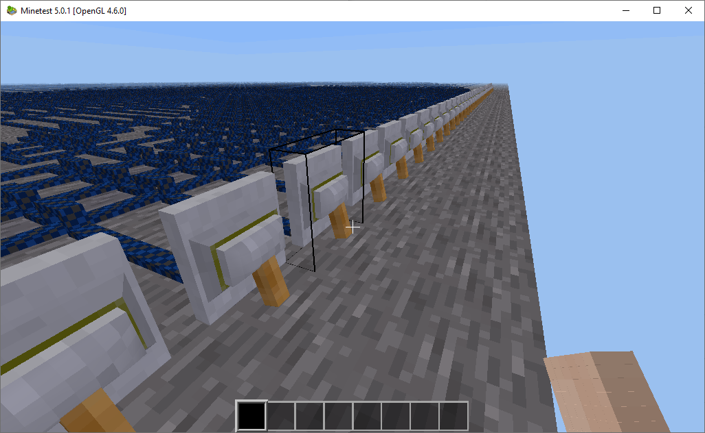
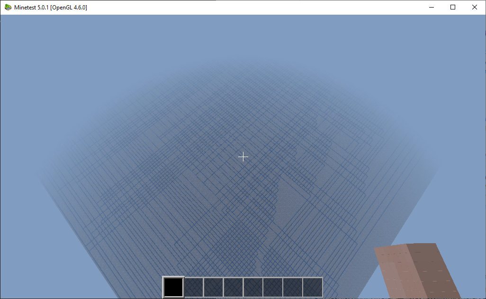
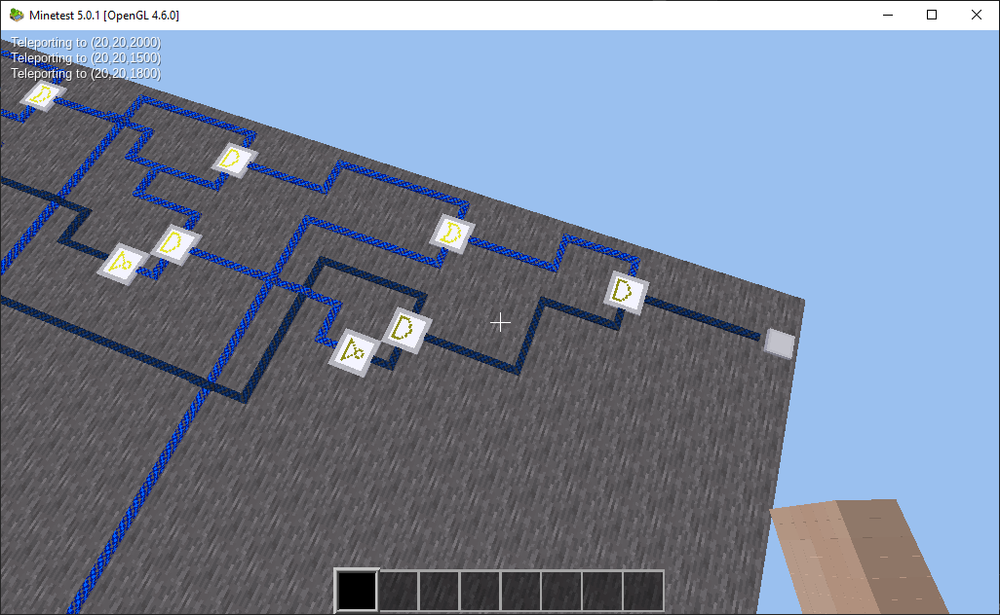
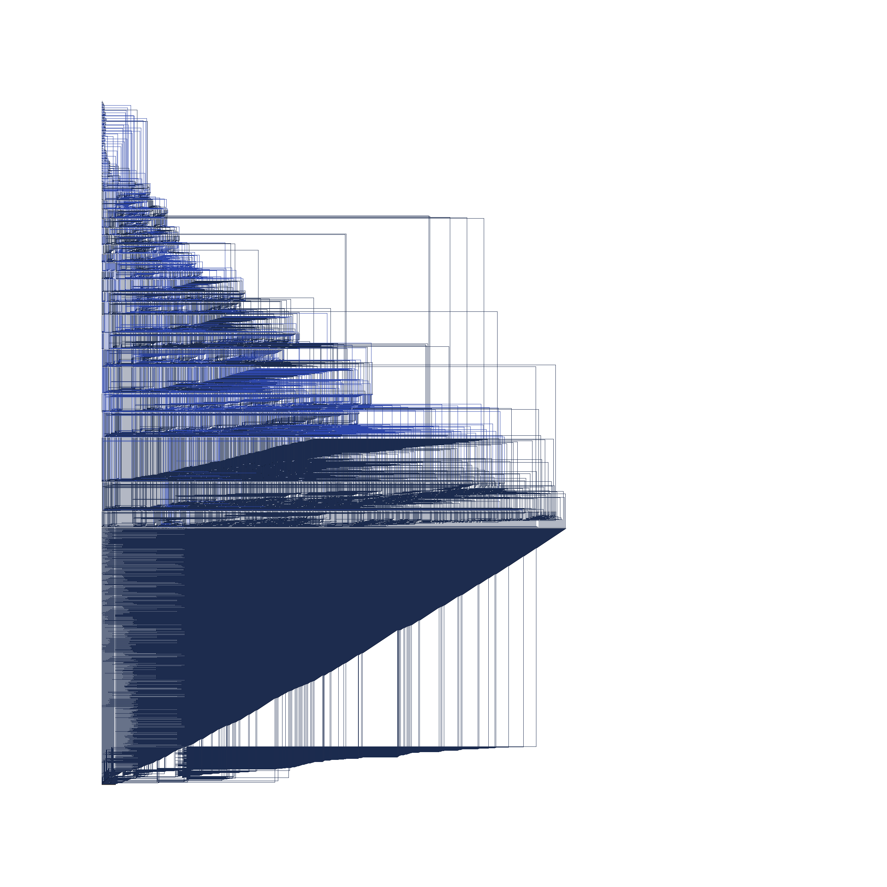
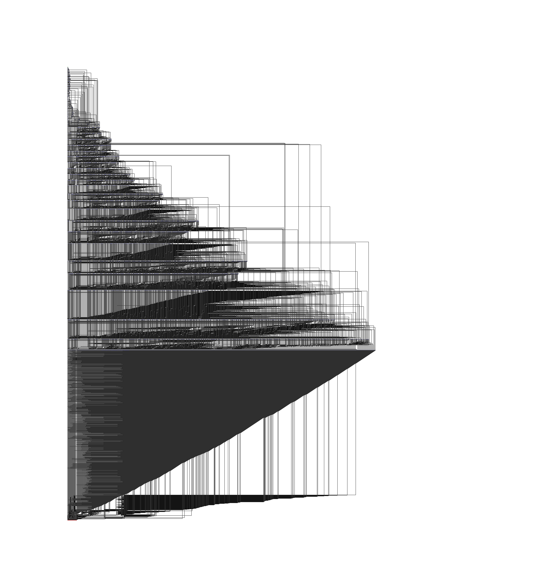
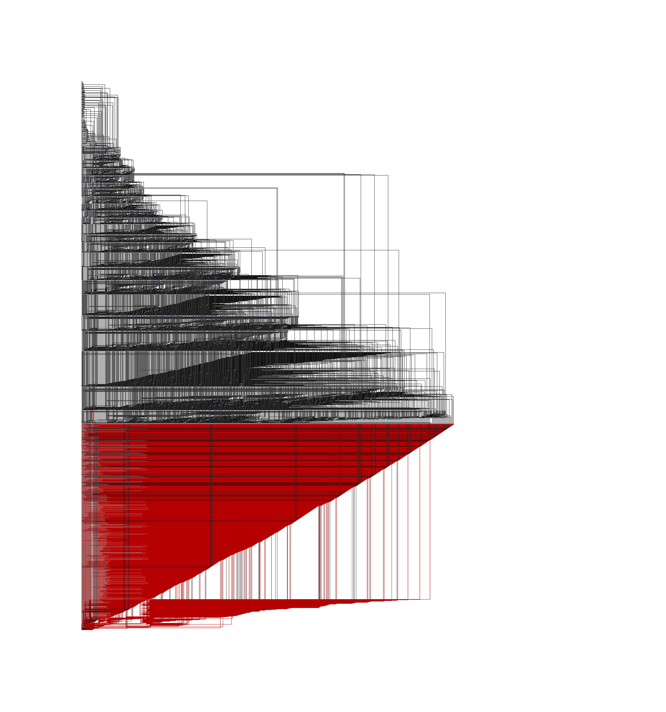

 # The sunk cost fallacy

 ## Introduction

This is a write-up on the Google CTF 2019 challenge `minetest`. The solution itself is much too complex. In retrospect, I have a hard time imagining a more convoluted way to solve this problem. As such, the purpose of this write-up is not to show off, but to entertain - so please enjoy.

## Step 1 - Understanding the problem

So what is a *minetest*? It seems to be an [open source game](https://github.com/minetest), which ~~blatantly copies~~ was inspired by Minecraft. The challenge comes with an attachment, a so-called *world* that can be loaded into the game. It uses a mod called [mesecons](https://github.com/minetest-mods/mesecons), which needs to be installed beforehand. Once you are in, you are greeted by this lovely sight:



The all encompassing darkness indicates that you have fallen off the map. And that it is late night in game time. So after a few rounds of looking up the controls, restoring the world to its original state and toggling flight mode, I managed to stay on the map.



Yep. Switches and wires, and a whole lot of them. Owing to my newfound powers of flight, I could ascend high above the plane, and realize... nothing. It turns out that the draw distance in this game is much too small (even at its highest setting) to give you a bird's eye view of the map.



I wanted to see if there is anything interesting in one of the other corners of the map. Luckily I found that you can teleport with the `/teleport X Y Z` command (Y being the vertical axis, for some reason), so I didn't have to walk all the way to ~~Mordor~~ the other side of the map. So I found that the circuit ends like this:



The [documentation](http://mesecons.net/items.html) of the mod that had to be downloaded has pictures of all the elements. Using that and my impeccable skills of deduction, I figured out that the last bit is a lamp, while those other boxes are various logic gates. At this point, what I had to do was obvious: find the correct combination of inputs (turning switches on and off) to have the lamp light up.

## Step 2 - Exploring possibilities

So I quickly came to the conclusion that spending the next 1 million years trying combinations for the 40 switches that were conveniently placed next to each other is not feasible. I needed to turn the in-game circuit into something I can work with. So I looked at the documentation of the game, and it turns out that they have an elegant, well-designed API that can be used from a variety of programming languages... oh, who am I kidding, of course it was a mess. After quite of bit of reading, I found three avenues worthy of further exploration:

* Parse the SQLite database that contains the blocks
* Add some LUA code to the game that exports the blocks
* Recompile the game code with some custom modifications to export the blocks

Parsing sounded like a major pain, as the SQLite database contains nothing but [binary blobs](https://github.com/minetest/minetest/blob/master/doc/world_format.txt) with zlib compressed metadata (worthy of the *Best Use of a Relational Database 2019* award). Even though there was a somewhat outdated Python [library](https://github.com/LeMagnesium/python-minetest) I could start with, I figured it would be easier to use the internal API or the LUA modding environment.

But then, I found [minetestmapper](https://github.com/minetest/minetestmapper). It generated a nice PNG file from the in-game world, where every pixel represented a block in the game. You just had to do a [little groundwork](https://github.com/minetest/minetestmapper/blob/master/autogenerating-colors.txt) to export the colors of the blocks, and run the application to get a nice image like this:



That is one huge circuit. So now I had another option: I could parse this image with its one pixel per block representation of the in-game world - and I went with it.

## Step 3 - Commitment

I removed all the unnecessary block types from the colors file, then assigned unique colors to each remaining component (see [colors.txt](colors.txt)). The generated map looked like this:



Yeah, just like the last one but with a bit more emo. I eagerly started designing my algorithm to parse this lovely image into an in-memory representation of the logic function - then I realized that as it is, the map contained no information on the orientation of the blocks. Now seeing that I could have just gone back to messing with LUA, but I didn't. The map had a strict directional layout: wires always went up or sideways and all gates had the same orientation. I felt confident I could come up with an algorithm that can fill in the blanks.

## Step 4 - Heuristics

I started with the levers, following the lines that started there, trying to find the next gate on their path. I would do this iteratively: each round, I would try to find where the wires went from the remaining unsolved levers and gates that have all of their inputs traced back to another gate or lever. I started with some fairly simple rules:

* Signals exit gates upwards
* Signals terminate when entering gates
* Straight segments (including crossovers) continue straight
* Corners, when entered horizontally, continue upwards
* When turning, you cannot continue towards empty space
* You can only step on a straight segment if there is a valid way forward

That wasn't enough - I had to do more:

* When checking whether I should go left, right or up, I switched to three state logic: a direction was either valid, invalid or unknown. This made it possible to resolve situations with both known and unknown results pointing to each possible direction.
* Disable blocks that were already assigned to a route - for crossovers, this was a two step process, first demoting them to simple straight wires.
* Keep track of half-results in the case of T junctions. When one half of the junction could be mapped but the other could not, close down the route that was mapped and mark that direction as closed.

With these rules in place, I could finally achieve a well-deserved stack overflow. Since I implemented my algorithm recursively, this was to be expected with input data of this size. I could have rewritten my code to do all this non-recursively, but since I live in the wonderful 21st century, where RAM is cheap and I have plenty, I just executed my code on a separate thread with a 256 MB stack. Elegant.

## Step 5 - The Light

The heuristics worked, and I was able to resolve all inputs for all gates. I even managed to export a nice animation on how the algorithm mapped the gates by exporting the state of the image after each iteration.



Now I had an in-memory representation, so I just exported it to a text file, using a simple syntax like this:
```
AND(OR(NOT(S1), S2), OR(S2, XOR(S7, S32)))
```
That produced an absolutely useless 140 MB file that was large enough to crash most text editors. Clearly I needed to do something else. Fortunately, one of my teammates suggested [Z3](https://github.com/Z3Prover/z3) - I used it a few years back, and I knew it had a .NET API, so I rewrote the models to evaluate to Z3 boolean expressions instead of strings.

Lo and behold, the equation was found to be satisfiable in mere seconds. I assigned names to the constants based on their X coordinate, so I could sort by their name and assemble the results into a series of bits that would be accepted as the flag:

```
CTF{1110010101000101110010111110000110011001}
```

## Conclusion

After spending an enormous amount of time guessing information about pixels in an image when I could have just exported all that and more from the source, I have to realize that my hubris has gotten in the way of reason. When I first encountered the issue with the missing orientation information, I should have either picked a different way of extracting the information or modified the mapper to extract the orientation and encode it in the color of the pixels. I did find the animation of my algorithm at work aesthetically pleasing, so there is that.

Take a look at the final code if you dare, and learn from my mistake: it is better to turn back when you have just left the intersection and the road ends.